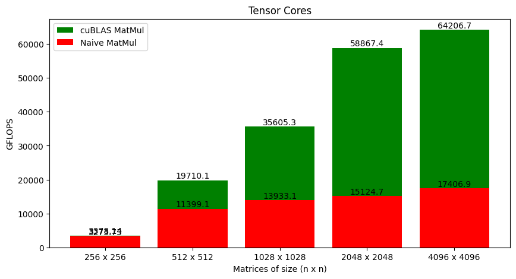

# tGeMM
General Matrix Multiplication using NVIDIA Tensor Cores. **Tested on NVIDIA RTX 3090 using Ubuntu 24.04.1 LTS with nvidia-driver-550 and CUDA 12.4**.

Custom data structures `MatrixFP16` and `MatrixFP32` are defined (in *src*) to make working with matrices easy. Supported features are as follows:
1. Define half precision `n x n` matrix `A_FP16` on RAM (host memory):
    
    `MatrixFP16 A_FP16 = MatrixFP16(n, n, false);`

2. Define half precision `n x n` matrix `d_A_FP16` on VRAM (device global memory):
    
    `MatrixFP16 d_A_FP16 = MatrixFP16(n, n, true);`

3. Define single precision `n x n` matrix `A_FP32` on RAM (host memory):
    
    `MatrixFP32 A_FP32 = MatrixFP32(n, n, false);`

4. Define single precision `n x n` matrix `d_A_FP32` on VRAM (device global memory):
    
    `MatrixFP32 d_A_FP32 = MatrixFP32(n, n, true);`

3. Randomly initialize FP16 or FP32 matrices:
    
    `random_init_mat(A_FP16, -10, 10); // Random Initialization between -10 and 10`
    
    `random_init_mat(A_FP32, -10, 10); // Random Initialization between -10 and 10`

4. Move matrix data from RAM to VRAM:
    
    `A_FP16.copy_to_device(d_A_FP16);`

5. Move matrix data from VRAM to RAM:
    
    `d_A_FP16.copy_to_host(A_FP16);`

6. Free host/device memory:
    
    `A_FP16.free_mat();`
    
    `FP16.free_mat();`

## cuBLAS vs Custom Matrix Multiplication using Tensor Cores

- For cuBLAS version run the command: `make 00_benchmark_cuBLAS.out`
- For custom version run the command: `make 01_benchmark_naive.out`

The naive version is a fair bit slower than cuBLAS. However, my point (as of now) is to show how tensor cores can be programmed. I've kept everything as simple as possible so that it's easy to understand the workings of tensor cores.
